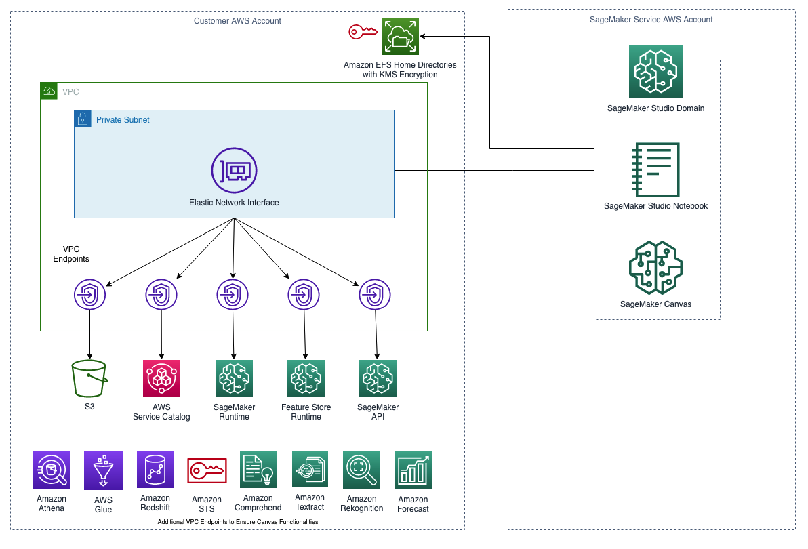
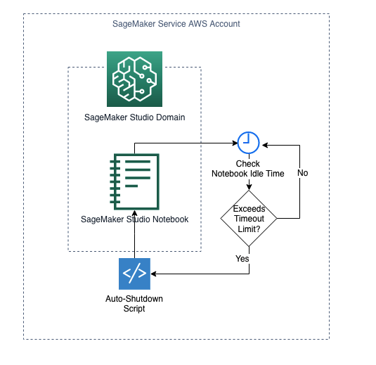

# Feature Rich Secure SageMaker Domain by Terraform

The solution will use Terraform to create:
- A VPC with subnets, security groups, as well as VPC endpoints to support VPC Only mode for the SageMaker Domain
- A SageMaker Domain in VPC Only mode with a user profile
- An AWS Key Management Service (KMS) key to encrypt the SageMaker Studio's Amazon Elastic File System (EFS) volume
- A Lifecycle Configuration attached to the SageMaker Domain to automatically shut down idle Studio notebook instances
- A SageMaker Domain Execution Role and IAM policies to enable SageMaker Studio and Canvas functionalities

## VPC Requirements to Use VPC Only Mode

To create a SageMaker Domain in VPC Only mode, it requires a VPC with the following configurations:

1. At least two private subnets, each in a different Availability Zone to ensure high availability. 
2. Ensure your subnets have the required number of IP addresses needed. We recommend between 2 and 4 IP addresses per user. The total IP address capacity for a Studio domain is the sum of available IP addresses for each subnet provided when the domain is created.
3. Set up one or more security groups with inbound and outbound rules that together allow the following traffic: 
- NFS traffic over TCP on port 2049 between the domain and the Amazon EFS volume.
- TCP traffic within the security group. This is required for connectivity between the JupyterServer app and the KernelGateway apps. You must allow access to at least ports in the range 8192-65535.
4. Create Gateway endpoints for S3. SageMaker Studio needs to access Amazon S3 from your VPC using Gateway VPC endpoints. After you create the gateway endpoint, you need to add it as a target in your route table for traffic destined from your VPC to Amazon S3.
5. Create interface VPC endpoints (AWS PrivateLink) to allow Studio to access the following services with the corresponding service names. You must also associate a security group for your VPC with these endpoints to allow all inbound traffic from port 443:
- SageMaker API : com.amazonaws.region.sagemaker.api
- SageMaker runtime: com.amazonaws.region.sagemaker.runtime. This is required to run Studio notebooks and to train and host models.
- SageMaker Feature Store: com.amazonaws.region.sagemaker.featurestore-runtime
- To use SageMaker Projects: com.amazonaws.region.servicecatalog

In addition to above VPC endpoints, to use SageMaker Canvas, you need to also create the following interface VPC endpoints:

- Amazon Forecast: com.amazonaws.region.forecast
- Amazon Forecast Query: com.amazonaws.region.forecastquery
- Amazon Rekognition: com.amazonaws.region.rekognition
- Amazon Textract: com.amazonaws.region.textract
- Amazon Comprehend: com.amazonaws.region.comprehend
- Amazon Security Token Service (STS): com.amazonaws.region.sts
- Amazon Redshift: com.amazonaws.region.redshift-data
- Amazon Athena: com.amazonaws.region.athena
- AWS Glue: com.amazonaws.region.glue

To view all VPC endpoints for each service you can use with SageMaker Canvas, please go to: https://docs.aws.amazon.com/sagemaker/latest/dg/canvas-vpc.html

## SageMaker Domain

### SageMaker Domain in VPC Only Mode



By launching SageMaker Domain in your VPC, you can control the data flow from your SageMaker Studio and Canvas environments. This allows you to restrict internet access, monitor and inspect traffic using standard AWS networking and security capabilities, and connect to other AWS resources through VPC endpoints. 

### KMS Encryption for SageMaker Studio's EFS Volume

The first time a user on your team onboards to SageMaker Studio, SageMaker creates an EFS volume for the team. A home directory is created in the volume for each user who onboards to Studio as part of your team. Notebook files and data files are stored in these directories.

You can encrypt your SageMaker Studio's EFS volume with a KMS key so your home directories' data are encrypted at rest. This Terraform solution creates a KMS key and use it to encrypt SageMaker Studio's EFS volume.

### SageMaker Domain Lifecycle Configuration to Auto-shutdown Idle Studio Notebooks


Lifecycle Configurations are shell scripts triggered by Amazon SageMaker Studio lifecycle events, such as starting a new Studio notebook. You can use Lifecycle Configurations to automate customization for your Studio environment. 

This Terraform solution creates a SageMaker Lifecycle Configuration to detect and stop idle resources that are incurring costs within Studio using an auto-shutdown Jupyter extension. Under the hood, the following resources are created/configured to achieve the desired result:

1. Create an S3 bucket and upload to the latest version of the auto-shutdown extension sagemaker_studio_autoshutdown-0.1.5.tar.gz. Later the auto-shutdown script will run s3 cp command to download the extension file from the S3 bucket on Jupyter Server start ups. Please refer to the following GitHub repos for more information regarding the [auto-shutdown extension](https://github.com/aws-samples/sagemaker-studio-auto-shutdown-extension) and [auto-shutdown script](https://github.com/aws-samples/sagemaker-studio-lifecycle-config-examples/blob/main/scripts/install-autoshutdown-server-extension/on-jupyter-server-start.sh).
2. Create an [aws_sagemaker_studio_lifecycle_config](https://registry.terraform.io/providers/hashicorp/aws/latest/docs/resources/sagemaker_studio_lifecycle_config) resource “auto_shutdown“. This resource will encode the autoshutdown-script.sh with base 64 and create a Lifecycle Configuration for the SageMaker domain.
3. For SageMaker domain default user settings, specify the Lifecycle Configuration arn and set it as default.

### SageMaker Execution Role IAM Permissions

As a managed service, SageMaker performs operations on your behalf on the AWS hardware that is managed by SageMaker. SageMaker can perform only operations that the user permits.

A SageMaker user can grant these permissions with an IAM role (referred to as an execution role). When you create a SageMaker Studio domain, then by default SageMaker allows you to create the execution role. You can restrict access to user profiles by changing the SageMaker user profile role. This Terraform solution attaches the following IAM policies to the SageMaker execution role:

- SageMaker managed AmazonSageMakerFullAccess policy. This policy grants the execution role full access to use SageMaker Studio. 
- A custom managed IAM policy to access the KMS key used to encrypt the SageMaker Studio's EFS volume.
- SageMaker managed AmazonSageMakerCanvasFullAccess and AmazonSageMakerCanvasAIServicesAccess policies. These policies grant the execution role full access to use SageMaker Canvas.
- In order to enable time series analysis in SageMaker Canvas, you also need to add the IAM Trust policy for Amazon Forecast. 

## Deployment

### Pre-requisites
- An AWS account.
- An IAM user with administrative access.
- AWS CLI. Check [this guide](https://docs.aws.amazon.com/cli/latest/userguide/getting-started-install.html) for up to date instructions to install AWS CLI.
- Terraform CLI. Check [this guide](https://developer.hashicorp.com/terraform/tutorials/aws-get-started/install-cli) for up to date instructions to install Terafrom for Amazon Linux.
- You must establish how the AWS CLI authenticates with AWS when you deploy this solution. To configure credentials for programmatic access for the AWS CLI, choose one of the options from [this guide](https://docs.aws.amazon.com/cli/latest/userguide/cli-chap-authentication.html)

### Clone the Code Repo and Download the Auto-shutdown Extension
- Clone the repo and navigate to the sagemaker-domain-vpconly-canvas-with-terraform folder: 
```
git clone https://github.com/aws-samples/sagemaker-domain-vpconly-canvas-with-terraform.git

cd sagemaker-domain-vpconly-canvas-with-terraform
```
- Download the auto-shutdown extension and place it in assets/auto_shutdown_template folder:
```
wget https://github.com/aws-samples/sagemaker-studio-auto-shutdown-extension/raw/main/sagemaker_studio_autoshutdown-0.1.5.tar.gz -P assets/auto_shutdown_template
```
- Your file structure should look like:
```
.
├── LICENSE
├── README.md
├── assets
│   └── auto_shutdown_template
│       ├── autoshutdown-script.sh
│       └── sagemaker_studio_autoshutdown-0.1.5.tar.gz
...
```

### Deployment Steps
In terminal, run the following terraform commands:

```
terraform init
```
You should see a success message like:
```
Terraform has been successfully initialized!

You may now begin working with Terraform. Try running "terraform plan" to see
any changes that are required for your infrastructure. All Terraform commands
should now work.

If you ever set or change modules or backend configuration for Terraform,
rerun this command to reinitialize your working directory. If you forget, other
commands will detect it and remind you to do so if necessary.
```
Now you can run:
```
terraform plan
```
After you are satisfied with the resources the plan outlines to be created, you can run:
```
terraform apply
```
Enter “yes“ when prompted to confirm the deployment. 

If successfully deployed, you should see an output that looks like:
```
Apply complete! Resources: X added, 0 changed, 0 destroyed.
```

## Cleaning up
Run the following command to clean up your resources
```
terraform destroy
```

*Tip: If you set the EFS retention policy as “Retain” (the default), you will run into issues during `terraform destroy` because Terraform is trying to delete the subnets and VPC when the EFS volume as well as its associated security groups (created by SageMaker) still exist. To fix this, first delete the EFS volume manually, and then delete the subnets and VPC manually in the AWS console.*